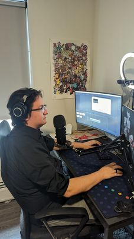

LearnMikrotik
=====

# Project Description
Welcome to LearnMikrotik! This project is designed for small buisnesses trying to achieve a pratical and secure network solution, while also trying to not break the bank.
Over the course of these lessons, you will learn how to set up your router, and implement basic but critical security control and network infastructure to bring your buisness to the next level.
This course is comprised of video lectures/walkthorughs, accompanied by text documentation to read ovver and review. We hope that these resources assist you in your journey to a better network enviroment. 

# The Team

| Connor Merchant | Sam Johnson | 
|-------------|-------------|
| .jpg)| |
| |  |
| Connor is the voice behind the videos. He has a background in Sysadmin with three years of experience working with small buisnesses. | Sam is the editor and documentation author, with his voice featured in the VPN lesson! Sam is a SysAdmin with three years of experience working in network technologies. 

